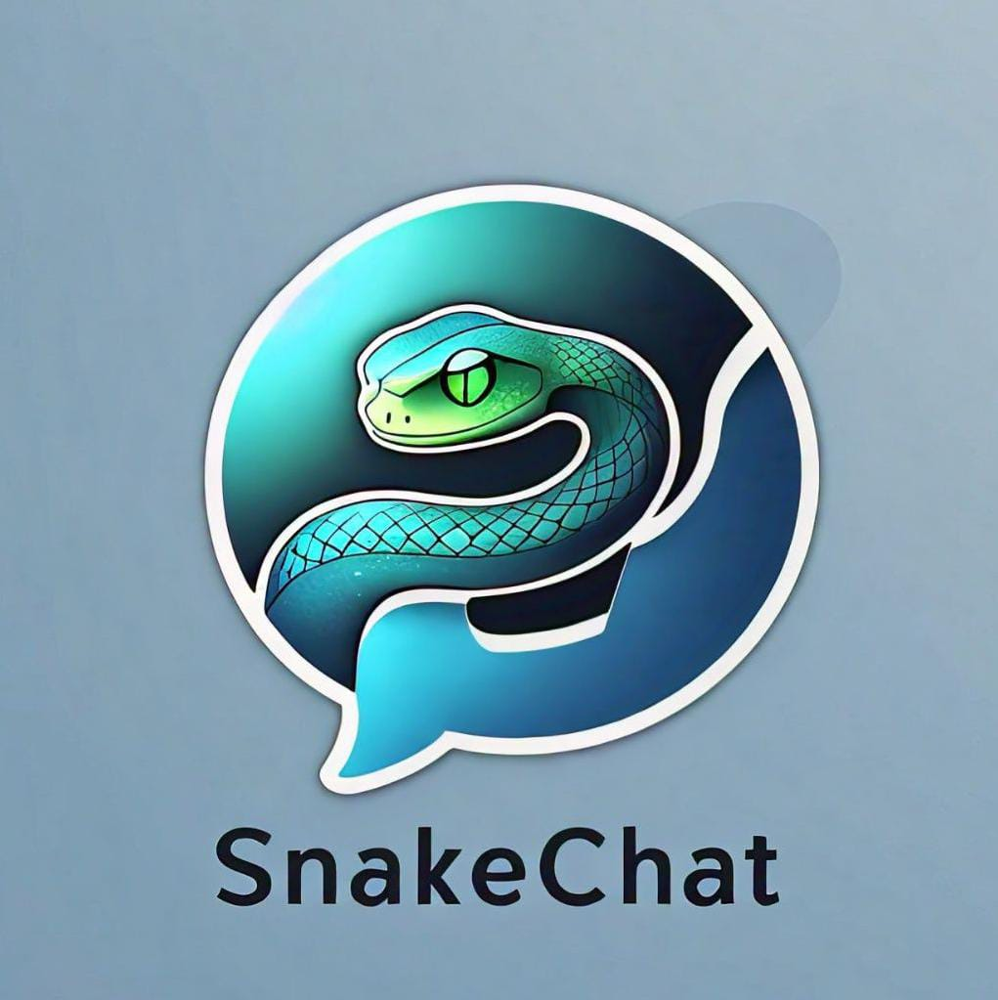

# <p align="center">SnakeChat WA 🐍</p> <p align="center"> 
</p>

[](https://wa.me/50557418454)
[](allstarf123@gmail.com)

SnakeChat es un proyecto de API WebSocket basado en una conexión no oficial de WhatsApp Web, diseñado principalmente para ser utilizado en Python. No requiere tokens ni claves externas para funcionar. Soporta interacciones con WhatsApp Web y es totalmente compatible con WhatsApp Multi-Devices. Al mismo tiempo, se busca que la conexión proporcione la mayoría de las funciones operativas básicas para evitar el uso de varias bibliotecas y dependencias adicionales en tu proyecto.

### Información:
* **SnakeChat no requiere el uso de Selenium u otros navegadores que afecten la velocidad de respuesta, ya que utiliza la biblioteca <a href="https://github.com/tulir/whatsmeow">Whatsmeow</a> como dependencia, lo que genera una interfaz de usuario funcional basado en lenguaje Golang. Esto también implica que el proyecto en cuestión que utilice SnakeChat no utilizará más de 1GB de RAM en recursos para su funcionamiento estandar, támbien permitiendo el uso de JID a diferencia de alternativas como Pyppeteer o sino los métodos mencionados anteriormente.**

### Funciones:
| Compatibilidad    | Status  |
|-----|---|
| Dispositivos Android e iOS | ✅ |
| Envío y recibido de mensajes de texto | ✅ |
| Envío y recibido de multimedia: audios, imagenes, documentos, videos y gif | ✅ |
| Recepción de eventos en grupos | ✅ |
| Envio de Botones y listas | ✅ |
| Pin de mensajes, emogis y nuevas funciones | ✅ |

### Instalación 
**Instala de forma sencilla usando:**
   ```bash
   pip install snakechat
   ```
